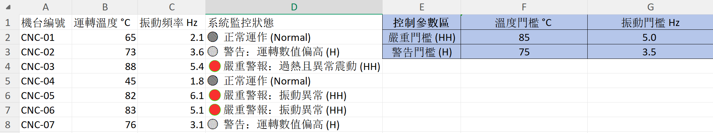
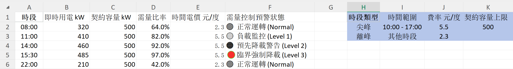

# 🏭試算表邏輯建模與生產管理控制系統 (Industrial Engineering Excel Models)


本專案庫包含 4 個基於生產管理標準建構的 Excel 邏輯模組。專案擺脫傳統單純試算表數據填寫與基礎運算思維，導入參數解耦、防呆驗證 與 權限控管 等系統架構思維，展現將工業控制、系統監控與數據邏輯完整落地於 Excel 的系統化設計能力。

---

## 💡 專案核心設計理念

1. **參數解耦**：將控制門檻、費率基準與規格上下限獨立至參數控制區，實現「修改參數即連動全表」，無需改動任何核心公式。
2. **階層式診斷**：採用多層巢狀邏輯算式，自動區分「權限不足」、「資料缺失」與「數值超標」，提供精準的系統診斷訊息。
3. **資料防呆與權限控制**：結合動態驗證與條件式格式化，防止無效寫入、越權操作與資料異常降級漏報。
4. **高可讀性與數據戰情化**：導入雙軸帕雷托圖與動態交叉篩選器，將底層數據迅速轉化為具備商業決策價值的管理視窗。

---

## 📌 核心模組與系統實作詳解 (Core Modules & System Logic)

### 1. SCADA 設備動態監控與階層式告警矩陣 



* **現場痛點**：傳統系統常採用單一門檻或獨立判斷，當溫度與振動同時異常時，容易因優先順序覆蓋而造成「極端異常降級漏報」（Alarm Masking）。
* **邏輯架構**：建立 HH/H (High-High / High) 雙階層複合警報機制，同步校驗運轉溫度 (°C) 與振動頻率 (Hz)。
* **使用的 Excel 函式與核心公式**：
  * **關鍵函式**：`IFS`、`AND`、`OR`、`絕對引用 ($)`
  * **核心邏輯算式**：
    ```excel
    =IFS(
        AND(B2>=$F$2, C2>=$G$2), "🔴 嚴重警報: 過熱且異常震動 (HH)",
        OR(B2>=$F$2, C2>=$G$2), "🔴 嚴重警報: 數值達 HH 門檻",
        OR(B2>=$F$3, C2>=$G$3), "🟡 警告: 運轉數值偏高 (H)",
        TRUE, "🟢 正常運作 (Normal)"
    )
    ```
* **技術細節**：
  * 使用絕對引用（`$E$2:$G$3`）將 HH 與 H 門檻抽出至「控制參數區」。
  * 系統自動比對即時數據並輸出精準診斷，實現門檻修改時全自動同步連動。

---

### 2. EMS 時間電價稽核與四階降載預警模型 



* **現場痛點**：廠房離尖峰電價計算繁雜，且當即時用電量逼近契約容量上限時，缺乏自動化的多階預警機制，易導致罰款風險。
* **邏輯架構**：
  * 自動精準稽核即時時間電價（TOU Rate, 元/度）。
  * 計算即時需量比率（即時用電 / 契約容量），觸發 Level 1~3 四階降載預警機制。
* **使用的 Excel 函式與核心公式**：
  * **關鍵函式**：`XLOOKUP`、`IFS`、`絕對引用 ($)`
  * **核心邏輯算式**：
    ```excel
    ; 1. 時間電價動態對照 (單價/度)
    =XLOOKUP(A2, $H$2:$H$3, $J$2:$J$3)

    ; 2. 需量控制四階預警狀態
    =IFS(
        D2>=0.95, "🔴 臨界強制降載 (Level 3)",
        D2>=0.90, "🟡 預先降載警告 (Level 2)",
        D2>=0.80, "🟡 負載監控 (Level 1)",
        TRUE, "🟢 正常運轉 (Normal)"
    )
    ```
* **技術細節**：
  * 預警邏輯涵蓋：`正常運轉` (<= 80%)、`負載監控 (Level 1)` (> 80%)、`預先降載警告 (Level 2)` (> 90%) 與 `臨界強制降載 (Level 3)` (> 95%)。
  * 契約容量（`$K$2`）與單價（`$J$2:$J$3`）全數參數化，費率或政策調整時可零風險即時維護。

---

### 3. MES/QA SOP 規格驗證與 RBAC 權限控管

#### 前台輸入與 QA 診斷校對


#### 後台 SOP 主規格與角色授權表 (Master Table)


* **現場痛點**：現場操作員誤輸入超出 SOP 規格之參數，或未授權人員（如 Operator 調整 Admin 權限參數）隨意更改機台設定，導致品質不良率上升。
* **邏輯架構**：
  * 動態檢核 SOP 上下限規格（USL/LSL）。
  * 導入角色權限控制（RBAC, Role-Based Access Control）邏輯，自動核對操作員權限是否符合該參數設定要求。
* **使用的 Excel 函式與核心公式**：
  * **關鍵函式**：`IFS`、`ISBLANK`、`XLOOKUP`、`OR`、`&` (字串串接)
  * **核心邏輯算式**：
    ```excel
    =IFS(
        ISBLANK(C2), "❌錯誤：參數不可為空",
        B2 <> XLOOKUP(A2, $G:$G, $K:$K), "❌錯誤：權限不足 (需 " & XLOOKUP(A2, $G:$G, $K:$K) & ")",
        OR(C2 < XLOOKUP(A2, $G:$G, $I:$I), C2 > XLOOKUP(A2, $G:$G, $J:$J)), "❌錯誤：超出 SOP 規格 (" & XLOOKUP(A2, $G:$G, $I:$I) & " - " & XLOOKUP(A2, $G:$G, $J:$J) & ")",
        TRUE, "✔️QA 驗證通過"
    )
    ```
* **技術細節**：
  * 階層式診斷優先順序：**1. 檢查空值** -> **2. 檢查權限** -> **3. 檢查 SOP 數值範圍** -> **4. 輸出通過狀態**。

---

### 4. TPM 設備六大損失與帕雷托數據分析儀表板 

#### 原始停機日誌資料表 (Raw Data Log)


#### 帕雷托樞紐分析表與互動式戰情儀表板 (Dashboard)


* **現場痛點**：停機日誌資料零散，未進行系統化歸因，致使改善資源無法精準投放在最關鍵的設備故障點上。
* **邏輯架構**：
  * 依據 TPM（全員生產管理）設備六大損失分類標準進行停機日誌歸納。
  * 自動計算關鍵累積貢獻度，構建雙軸圖與 80% 警戒線。
* **使用的 Excel 功能與技術**：
  * **關鍵功能**：`Pivot Table`（樞紐分析表）、`Running Total % in`（按特定欄位累計的百分比）、`Pareto Chart / Combo Chart`（雙軸組合圖）、`Slicer`（動態交叉篩選器）
  * **進階值顯示設定**：設定欄位顯示方式為 `Running Total % in`，指定欄位為 `TPM 損失分類`。
* **技術細節**：
  * 繪製專業雙軸帕雷托圖（Pareto Chart），直觀展現符合 80/20 法則的瓶頸項目（如設備故障累計占比達 72.5%）。
  * 配置「機台編號」與「運轉班別」互動式交叉篩選器（Slicer），支援即時切換動態交叉分析。

---

## 🛠️ 核心 Excel 技術棧與設計模式 (Tech Stack & Architecture)

| 技術類別 | 關鍵函數 / 功能 | 工業應用情境與優勢 |
| :--- | :--- | :--- |
| **進階邏輯算式** | `XLOOKUP`, `IFS`, `SWITCH`, `AND`, `OR`, `ISBLANK` | SCADA 複合告警判定、MES SOP 規格動態檢核、EMS 時間電價自動查表 |
| **架構設計** | 絕對引用 (`$`)、參數解耦 (Decoupling) | 獨立動態門檻區，降低模組間耦合度，實現無程式碼改變維護 |
| **數據防呆與權限** | Data Validation, RBAC, Nested Error-Trapping | 未授權輸入攔截、空值與異常資料隔離、超標自動輸出診斷語法 |
| **數據分析與視覺化**| Pivot Table (% Running Total), Pareto Chart, Slicer | TPM 設備六大損失歸因、80/20 瓶頸定位、動態戰情室互動儀表板 |

---

## 🎯 專案效益與工程價值 (Business & Engineering Impact)

* **系統維護性 (Maintainability)**：解耦設計使廠務或品保人員無須修改任何邏輯算式，即可透過更新參數區完成全廠規則維護。
* **數據穩健性 (Robustness)**：嚴密的多層防呆機制，杜絕未授權輸入或格式錯誤導致的後端算式崩潰。
* **決策高效性 (Decision Efficiency)**：將繁雜的停機紀錄轉化為帕雷托戰情儀表板，協助管理層 3 秒內定位 80% 影響產能的核心問題。

---

## 📂 專案檔案結構 (Repository Structure)

```text
.
├── images/
│   ├── 備運轉動態監控與警報邏輯模組.png
│   ├── 廠房時間電價計算與契約容量超標預警.png
│   ├── MES 後台 RBAC 權限與 SOP 規格QA 驗證模組-1.png
│   ├── MES 後台 RBAC 權限與 SOP 規格QA 驗證模組-2.png
│   ├── TPM 設備損失分類.png
│   └── TPM 設備損失分類樞紐分析表.png
├── 01_SCADA_Alarm_Matrix.xlsx            # SCADA 告警矩陣與參數解耦模組
├── 02_EMS_TOU_LoadShedding.xlsx          # EMS 時間電價稽核與降載預警模組
├── 03_MES_SOP_RBAC_Validation.xlsx      # MES SOP 規格驗證與 RBAC 防呆模組
├── 04_TPM_Pareto_Downtime_Analysis.xlsx    # TPM 六大損失與帕雷托樞紐分析表
└── README.md                             # 專案說明文件
